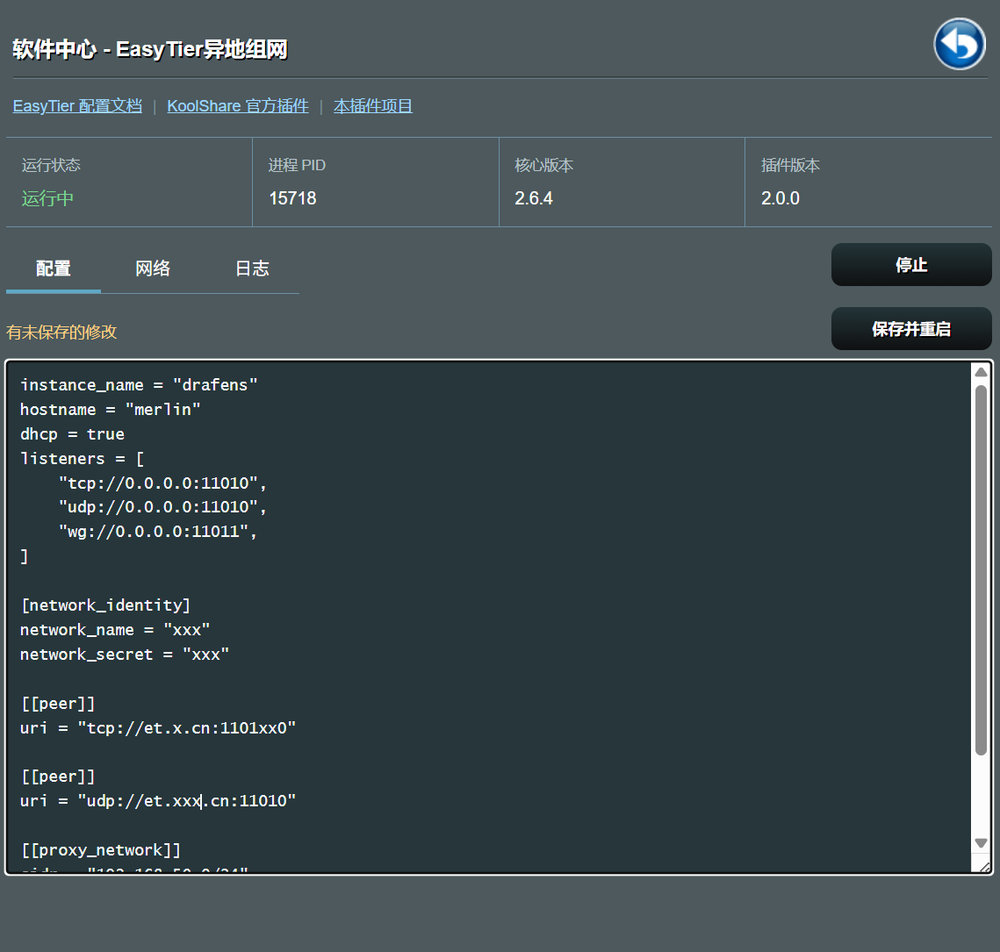
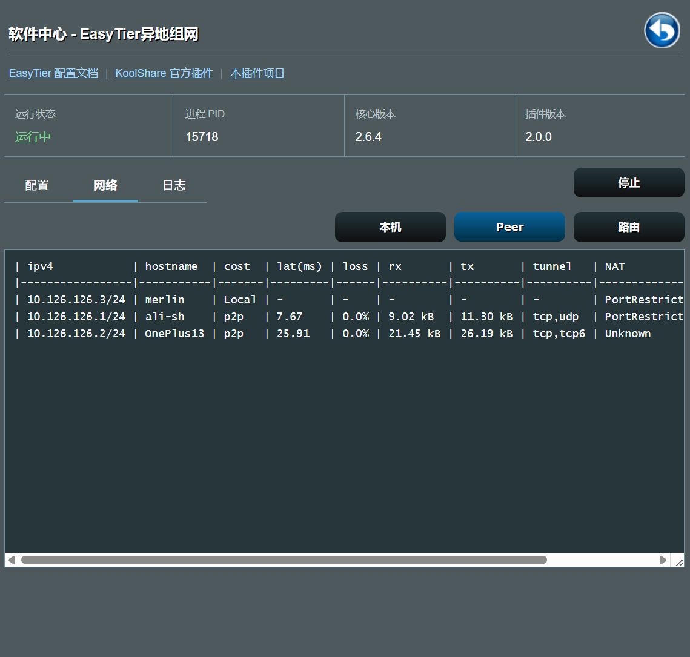
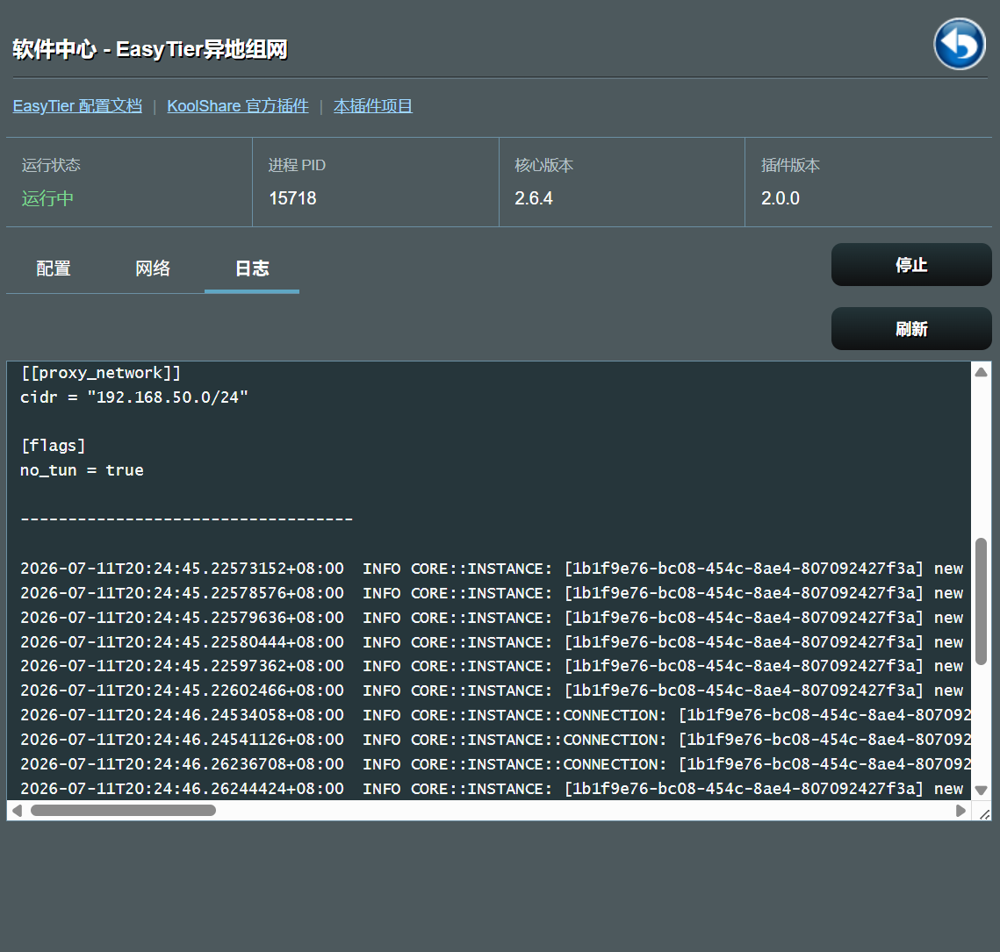

# koolshare-easytier

适用于 ASUSWRT KoolShare/Softcenter 的 EasyTier 异地组网插件。

插件遵循“薄适配”原则：EasyTier 负责配置解析和组网能力，插件只负责 Softcenter 集成、配置事务、服务生命周期和状态展示。

> **NOTE:** 2.0 版本相比旧版本的配置存储、后端接口和管理页面均有较大调整。建议先备份 `/koolshare/configs/easytier.toml`，在软件中心卸载旧版本后再安装 2.0 版本。2.0 版本的普通卸载会保留该配置文件。

> **NOTE:** 当前版本仅在 HND 平台的 ASUS RT-BE88U 上做过充分验证。其他平台和机型虽然提供了构建映射，但安装前请自行确认 CPU 架构并做好配置备份。

## 功能

- 使用 EasyTier 原生 TOML 配置
- 保存前由 `easytier-core --check-config` 校验 TOML
- 保存不影响当前实例，重启服务后应用新配置
- PID 校验、RPC 启动确认、超时停止和并发操作锁
- 查看本机、Peer、路由和核心日志
- 响应式 ASUS/Softcenter 原生管理页面
- 固定版本下载并校验 GitHub Release SHA-256 digest

## 界面预览

### 配置管理



### 网络状态



### 运行日志



## TOML 配置示例

以下配置用于展示常见的路由器组网方式。请按实际网络修改网络名称、密钥、Peer 地址和代理网段：

```toml
instance_name = "drafens"
hostname = "merlin"
dhcp = true
listeners = [
    "tcp://0.0.0.0:11010",
    "udp://0.0.0.0:11010",
    "wg://0.0.0.0:11011",
]

[network_identity]
network_name = "xxx"
network_secret = "xxx"

[[peer]]
uri = "tcp://et.x.cn:1101xx0"

[[peer]]
uri = "udp://et.xxx.cn:11010"

[[proxy_network]]
cidr = "192.168.50.0/24"

[flags]
no_tun = true # Router environments commonly run without a TUN device.
```

完整字段说明请参考 [EasyTier 配置文档](https://easytier.cn/guide/network/configurations.html)。

## 更新核心

必须显式指定架构和版本：

```sh
./update_bins.sh aarch64 2.6.4
```

支持的架构取决于 EasyTier 官方 Release，例如 `aarch64`、`arm`、`x86_64` 和 `mips`。脚本不会静默使用 latest。

## 构建

平台和 EasyTier 架构映射维护在 `manifest/platforms.conf`：

```sh
./build.sh hnd
```

构建会检查版本元数据、二进制 ELF 架构，并生成商店所需 MD5 和额外的 SHA-256。

发布版本由插件版本和 EasyTier 核心版本组成。例如插件 `2.0` 搭配核心 `2.6.4` 时，软件中心和安装包统一使用 `2.0.264`：

```text
easytier_hnd_aarch64_v2.0.264.tar.gz
```

## 测试

```sh
./tests/run.sh
```

测试覆盖 Shell 语法、服务锁、PID 生命周期、幂等启动、无效配置拒绝和配置事务。

## 路由器路径

- 配置：`/koolshare/configs/easytier.toml`
- PID：`/var/run/easytier.pid`
- EasyTier核心日志，写入 `/tmp/easytier/easytier.log`；
- 插件Shell日志，写入 `/tmp/easytier/easytier-service.log`；
- 单文件约 1 MiB，并保留一个`.1` 的归档； 可在日志页面手动清理；

普通卸载保留用户配置。仅显式执行卸载脚本的 `purge` 模式时删除配置。

完整架构和验收标准见 [docs/architecture.md](docs/architecture.md)。

## 许可证

插件采用 [LGPL-3.0](LICENSE)。EasyTier 核心由 [EasyTier](https://github.com/EasyTier/EasyTier) 项目提供并遵循其许可证。
